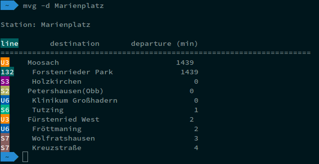

# A console program to request the departure time from the MVG

This python script is based on the work of [leftshift](https://github.com/leftshift/python_mvg_api). Check out his work for more info on the API.

## Getting started

`git clone https://github.com/frankzl/python_mvg_console_program`

If you don't have pipenv, install it with pip:
`pip install pipenv`

Open a `pipenv shell` to install the dependencies:
```
$ pipenv shell
(mvg-program) $ pipenv install
```

Then add an alias to your shell, for example for ZSH add the following line to your `.zshrc`:

`alias mvg="python3.5 $HOME/path/to/directory/python_mvg_console_program/get_info.py"`

## Usage
`mvg --help` will list possible commands.

## Demo

